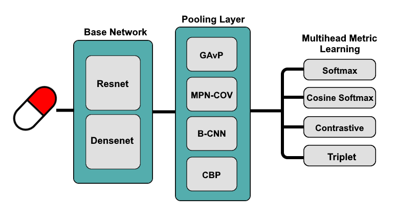
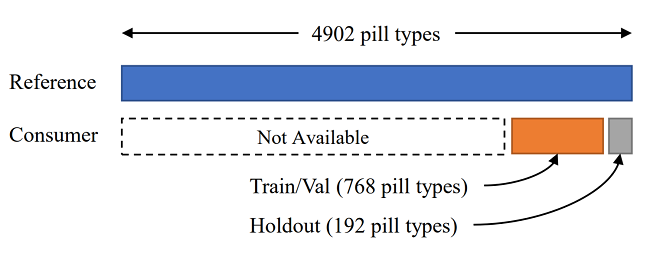

# ECE 228 Team 55 Oral Pill Identification 

This repository is created for the final project of ECE 228. In this project, we implmented various models with different combinations of backbone  networks, pooling layers, and metric-learning approach, and studied their impact on image-based medication identification. 

## Model architecture  

The model architecture overview is shown here. The best model that we found is to use a base netowrk of ResNet152, a Blinear CNN Pooling Layer and a multihead-metric learning for classification, with a MAP score of 95.65 and GAP score of 83.66. 


## Dataset 
The dataset that we use can be downloaded from [ePillID benchmark](https://github.com/usuyama/ePillID-benchmark/releases/download/ePillID_data_v1.0/ePillID_data.zip). After unzipping the file, we will have 2 folders: 

* `classification_data`: Contains the reference images (taken with controlled lighting and backgrounds) and consumer images (taken with real-world setting). All the labels and information of each image is listed in `all_labels.csv`. A sample comparison of reference and consumer image: 

* `folds`: Contains the training, validation set split for 4-fold cross validation. The consumer images are further exclusively split into training and holdout sets for final evaluation. 

The dataset distribution can be seen here.

 . 
 
This dataset is truncated from public databases to create a low-shot recognition setting: 
* [NIH NLM Pill Image Recognition Challenge dataset](https://pir.nlm.nih.gov/challenge/)
* [NIH NLM Pillbox](https://pillbox.nlm.nih.gov/statistics.html).

## Repository Layout
```
├── imgs #Contains the images for README file
├── src
│   ├── config
│   │   └── params.json #Contains the default input parameters to function
│   ├── models
│   │   ├── fast-MPN-COV #MPN-COV pooling layer implmentation
|   |   |   └── ...
│   │   ├── embedding_model.py  #Embedding layer implementation
│   │   ├── fast_MPN_COV_wrapper.py #Pooling layer wrapper to use different pooling method
│   │   ├── focal_loss.py #Focal loss of multi-head loss implmentation
│   │   ├── losses.py #Multi-head loss class implementation
|   |   ├── margin_linear.py #Embedding layer to classification layer implmentation
│   │   └── multihead_model.py #Multi-head model implmentation
│   ├── arguments.py #Argument parser
│   ├── classif_utils.py #Helper class to read images and resources
│   ├── image_augmentators.py #Image augmentation using imgaug package
│   ├── metric_test_eval.py #Model performance evaluation implmentation
│   ├── metric_utils.py #Helper function to select metrics and samples
│   ├── metrics.py #Metric computation implementation
│   ├── multihead_trainer.py #Full model implementation
│   ├── pillid_datasets.py #Data preprocessing and loading 
│   ├── sanitytest_eval.py #Basic evaluation functions
│   ├── train_cv.py #Main train script with CV
│   └── train_nocv.py #Main train script without CV
└── ECE228_Oral_Pill_Identification.ipynb #Main script to install all dependencies and run model in Google Colab
```

## Installation and Setup

We recommend running the training and testing experiment with Google Colab using our prepared  *[Google Colab script](ECE228_Oral_Pill_Identification.ipynb)*. We show all the installation and setup steps in this notebook,including dataset, repository, and commands to train and test the model. All dependencies and packages work as tested on June 9th, 2022. 

If you have any problems with package and dependencies, you can check the the original [ePillID benchmark github repository docker file](
 https://github.com/usuyama/ePillID-benchmark/tree/master/docker) for a package list.

## Notes and Acknowledgement

We forked the original [ePillID Benchmark repo](https://github.com/usuyama/ePillID-benchmark), modified and implemented their code to run models with different combination of base networks and pooling layers. 


